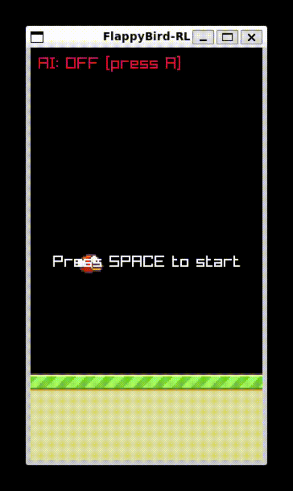

# FlappyBird-CPP-RAYLIB-RL-GRPO

A Flappy Bird game implementation with AI reinforcement learning capabilities, built with C++ and Raylib.  
To train the RL Model, GRPO method is partially adapted instead of PPO or DQN.

## Features

- Classic Flappy Bird gameplay with keyboard controls
- AI control mode that uses a pre-trained reinforcement learning model
- Real-time visualization of AI decision-making process
- Pixel-perfect collision detection
- Smooth bird animation and physics


## Dependencies

- [Raylib](https://www.raylib.com/)
- [ONNX Runtime](https://onnxruntime.ai/)
- C++17 or later

## GamePlay

### Controls

- **Space** - Start game / Make the bird flap
- **A** - Toggle AI control mode (when available)
- **Esc** - Exit the game

## Installation
### Installing Dependencies

You can install all required dependencies using the provided Makefile:

```bash
# Install all dependencies (Raylib and ONNX Runtime)
make install_deps
```

Or install them individually:

```bash
# Install Raylib
make install_raylib

# Install ONNX Runtime
make install_onnx
```

### Building from Source

```bash
# Clone the repository
git clone https://github.com/yourusername/flappy_bird_go.git
cd flappy_bird_go

# Build the executable
make

# Set up environment variables (if needed)
make setup_env
```

### Creating a Distribution Package

```bash
# Create a distributable package
make dist
```

## Usage

Run the executable after building:

```bash
# Run directly
make run

# Or manually
./flappy_bird
```


## How It Works

The AI uses a reinforcement learning model trained to play Flappy Bird. The game converts the current frame into a format the neural network can understand, and the model outputs probabilities for two actions: "do nothing" or "flap."

### Model Training Methodology

The model was trained based on the Group Relative Policy Optimization (GRPO) approach, which was originally introduced for training large language models. GRPO is an alternative to traditional methods like Proximal Policy Optimization (PPO), designed to improve efficiency and scalability.

#### Pixel-Based CNN Architecture

The AI agent uses a Convolutional Neural Network (CNN) that processes raw pixel data from the game screen. This approach allows the AI to learn directly from visual input, similar to how a human player would perceive the game:

- Game frames are captured, preprocessed to 84x84 grayscale four images, and stacked to provide temporal information
- These frames pass through a series of convolutional layers to extract spatial features like pipe positions and bird location
- The CNN architecture automatically learns relevant visual features without requiring hand-crafted state representations
- The network outputs action probability distribution based directly on pixel patterns it has learned during training

#### GRPO Training Method is adapted instead of DQN or PPO

This implementation adapts the GRPO methodology by:
- Eliminating the need for a critic network (value function)
- Collecting multiple rollouts to calculate advantage estimates
- Averaging advantages across these rollouts to get more stable policy updates

When AI mode is enabled, you can see:
- The processed 4 frames used as input to the neural network
- Real-time probabilities for each action
- Visual indicator when the AI decides to flap

## Project Structure

- `assets/` - Game sprites and audio files
- `trained_models/` - Pre-trained ONNX model for AI control

## Credits
This project is inspired by the original Flappy Bird game created by Dong Nguyen
and by https://github.com/vietnh1009/Flappy-bird-deep-Q-learning-pytorch 


## License

This project is licensed under the MIT License - see the LICENSE file for details.
