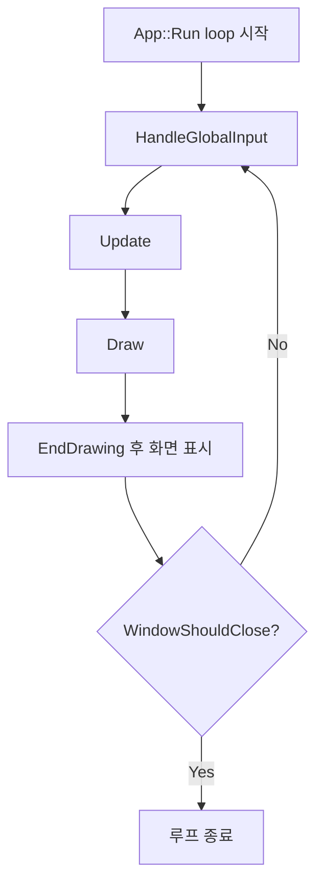
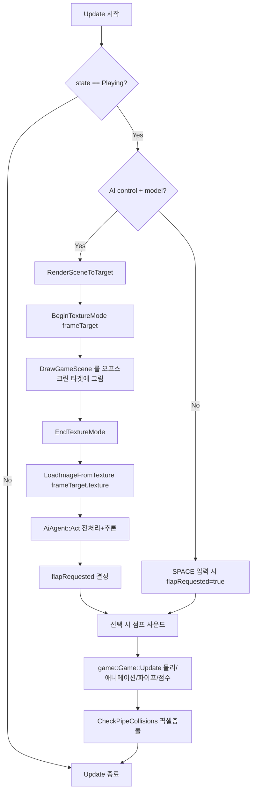
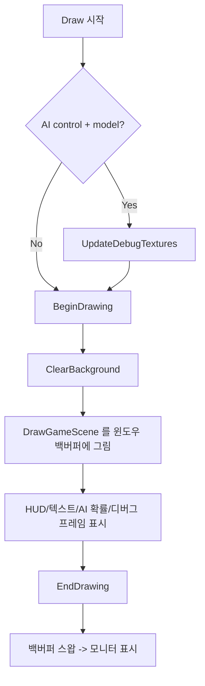

# Rendering Flow Diagram

아래 다이어그램은 `App::Run()` 루프에서 한 프레임이 처리되는 순서와,
특히 `frame -> texture -> render target -> screen` 경로를 보여줍니다.

## 1) Main Loop (한 프레임 단위)

## 2) Update 단계 (AI ON/OFF 분기 포함)

## 3) Draw 단계 (실제 화면 렌더)

## 4) Frame -> Texture -> Render Target 경로 요약

```mermaid
flowchart LR
    S[게임 월드 상태 Game::Bird Pipes Score] --> R0[DrawGameScene]
    R0 --> RT[RenderTexture frameTarget GPU]
    RT --> I[LoadImageFromTexture CPU Image]
    I --> P[Preprocess 84x84 gray/binary]
    P --> N[ONNX policy inference]
    N --> A[action flap/no flap]
    A --> U[다음 Update 물리 반영]
    U --> SCR[Draw 시 최종 화면 백버퍼 렌더]
    SCR --> M[모니터 출력]
```

