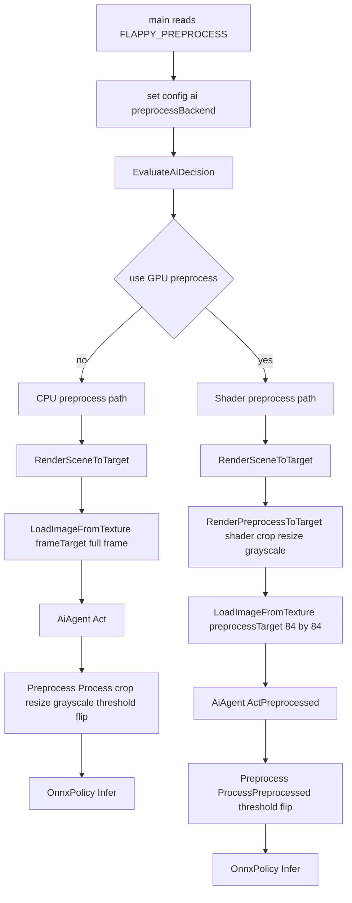
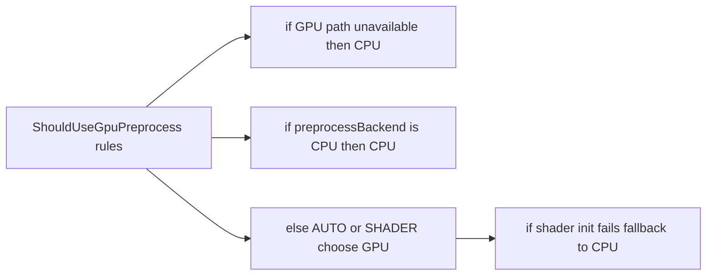

# Preprocess Flow Diagram

```mermaid
flowchart TD
  A["main reads FLAPPY_PREPROCESS"] --> B["set config ai preprocessBackend"]
  B --> C["EvaluateAiDecision"]
  C --> D{"use GPU preprocess"}

  D -->|no| E["CPU preprocess path"]
  D -->|yes| F["Shader preprocess path"]

  E --> E1["RenderSceneToTarget"]
  E1 --> E2["LoadImageFromTexture frameTarget full frame"]
  E2 --> E3["AiAgent Act"]
  E3 --> E4["Preprocess Process crop resize grayscale threshold flip"]
  E4 --> E5["OnnxPolicy Infer"]

  F --> F1["RenderSceneToTarget"]
  F1 --> F2["RenderPreprocessToTarget shader crop resize grayscale"]
  F2 --> F3["LoadImageFromTexture preprocessTarget 84 by 84"]
  F3 --> F4["AiAgent ActPreprocessed"]
  F4 --> F5["Preprocess ProcessPreprocessed threshold flip"]
  F5 --> F6["OnnxPolicy Infer"]
```

```mermaid
flowchart LR
  P0["ShouldUseGpuPreprocess rules"]
  P0 --> P1["if GPU path unavailable then CPU"]
  P0 --> P2["if preprocessBackend is CPU then CPU"]
  P0 --> P3["else AUTO or SHADER choose GPU"]
  P3 --> P4["if shader init fails fallback to CPU"]
```

## Reference Code

- `src/app/App.Ai.cpp:10`
- `src/app/App.Ai.cpp:59`
- `src/ai/Preprocess.cpp:14`
- `src/ai/Preprocess.cpp:49`
- `src/app/App.Init.cpp:126`
